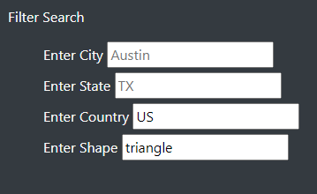

# UFO's
## Project Purpose
&emsp; The main purpose of this project is to present all the data as a table and create a filter function so that anyone with access to it can sort through different sightings of UFO.

## Results
&emsp; We have successfully created a webpage with filterable data table for all the sightings reported in January 2010. 
&emsp; Dana and other users can filter through the table with the provided input fields on the left. For example, if Dana wanted to see only triangles sighted in the US, she can type in US and triangle in the fields and hit enter and the table will look like the following.  

## Summary
&emsp; One drawback of this is that we can't filter through the duration of the sightings. The comments are also cut out at times. I would recommend that we add another filter so one can filter through duration of sightings. Another recommendation I would make is that we provide complete comments in the comment section as well as cleaning up the comments with seemingly gibberish in there like "&#44".